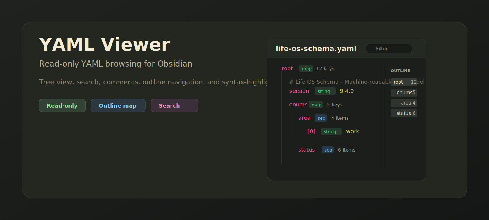

<p align="center">
  
</p>

<p align="center">
  <a href="https://github.com/viggomeesters/obsidian-yaml-viewer/releases/latest"></a>
  <a href="LICENSE"></a>
  
  
</p>

# YAML Viewer

YAML Viewer is a read-only Obsidian plugin for browsing `.yaml` and `.yml` files as a structured tree. It is built for schema files, configuration files, data contracts, and other YAML documents where comments and formatting matter.


## Features

- Opens `.yaml` and `.yml` files in a dedicated Obsidian view.
- Shows maps, sequences, scalars, aliases, document comments, node comments, and parse errors.
- Filters the tree by key, value, or YAML path.
- Provides a right-side outline for fast navigation through large YAML files.
- Includes expand/collapse controls, copy raw YAML, and copy-path buttons.
- Shows raw YAML with lightweight syntax highlighting and line numbers.
- Stays read-only by design: it never writes back to your YAML files.

## Why read-only?

YAML files often contain comments, anchors, ordering, and formatting that matter. A form editor can easily reserialize YAML and damage those details. YAML Viewer intentionally does not write to disk, so it cannot reformat or corrupt source-of-truth configuration files.

## Installation

### Community plugin directory

YAML Viewer is ready for submission to the Obsidian Community plugin directory. Once accepted, it can be installed from **Settings -> Community plugins -> Browse** inside Obsidian.

### Manual installation

Until the community directory submission is accepted:

1. Download `main.js`, `manifest.json`, and `styles.css` from the [latest release](https://github.com/viggomeesters/obsidian-yaml-viewer/releases/latest).
2. Create this folder in your vault: `.obsidian/plugins/yaml-viewer/`.
3. Put the downloaded files in that folder.
4. Reload Obsidian.
5. Enable **YAML Viewer** in **Settings -> Community plugins**.

### BRAT installation

For beta testing, install the plugin with [BRAT](https://github.com/TfTHacker/obsidian42-brat) using this repository URL:

```text
https://github.com/viggomeesters/obsidian-yaml-viewer
```

## Usage

Open any `.yaml` or `.yml` file in your vault. Obsidian will open it with YAML Viewer.

Use the toolbar to:

- filter visible nodes
- expand or collapse the tree
- copy the raw YAML source
- copy individual YAML paths from tree rows

Use the outline panel to jump through large files quickly.

## Development

```bash
npm install
npm run build
npx tsc --noEmit
```

For local development, copy or symlink this repository into `.obsidian/plugins/yaml-viewer/` inside an Obsidian vault.

## Release process

Obsidian installs community plugin files from GitHub releases. For each release:

1. Update `manifest.json`, `package.json`, and `versions.json`.
2. Run `npm install`, `npm run build`, and `npx tsc --noEmit`.
3. Create a GitHub release whose tag exactly matches `manifest.json.version`.
4. Attach `main.js`, `manifest.json`, and `styles.css` as release assets.

The release workflow in `.github/workflows/release.yml` can publish those assets after the version has been updated and committed.

## Community directory submission

The repository is prepared for Obsidian Community plugin submission. The remaining submission step must be completed by the repository owner in the Obsidian Community site because it requires signing in, linking GitHub, and confirming the developer policies/support commitment.

Submit this repository URL:

```text
https://github.com/viggomeesters/obsidian-yaml-viewer
```

Steps:

1. Sign in to [community.obsidian.md](https://community.obsidian.md).
2. Link the GitHub account that owns this repository.
3. Open **Plugins -> New plugin**.
4. Enter the repository URL above.
5. Confirm the developer policies and submit.
6. Address any automated review feedback.

The current release is ready for review:

- root `README.md`, `LICENSE`, and `manifest.json` exist
- `manifest.json.version` is `0.1.1`
- GitHub release `0.1.1` exists
- release assets include `main.js`, `manifest.json`, and `styles.css`
- `versions.json` maps supported Obsidian versions

Official references:

- [Submit your plugin](https://docs.obsidian.md/Plugins/Releasing/Submit%20your%20plugin)
- [Obsidian releases repository](https://github.com/obsidianmd/obsidian-releases)

## License

[MIT](LICENSE)
