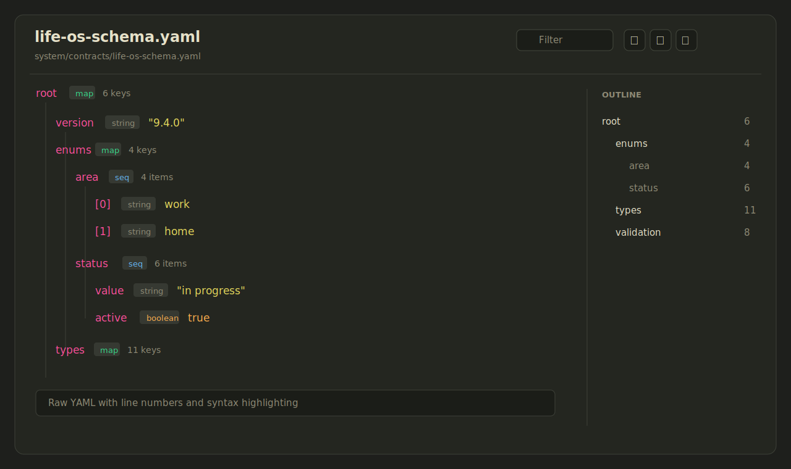

# YAML Viewer

YAML Viewer is a read-only Obsidian plugin for browsing `.yaml` and `.yml` files as a structured tree.



## Features

- Opens `.yaml` and `.yml` files in a dedicated read-only view.
- Shows maps, sequences, scalars, aliases, comments, and parse errors.
- Filters the tree by key, value, or YAML path.
- Provides an outline panel for fast navigation through large YAML files.
- Includes expand/collapse controls and copy-path buttons.
- Shows the raw YAML source with lightweight syntax highlighting.

## Why read-only?

YAML files often contain comments, anchors, ordering, and formatting that matter. This plugin intentionally does not write back to disk, so it cannot accidentally reformat or corrupt source-of-truth configuration files.

## Manual installation

1. Download `main.js`, `manifest.json`, and `styles.css` from the latest release.
2. Create this folder in your vault: `.obsidian/plugins/yaml-viewer/`.
3. Put the downloaded files in that folder.
4. Reload Obsidian.
5. Enable **YAML Viewer** in **Settings -> Community plugins**.

## Development

```bash
npm install
npm run build
```

For local development, copy or symlink this repository into `.obsidian/plugins/yaml-viewer/` inside an Obsidian vault.

## Release

Obsidian installs community plugin files from GitHub releases. For each release:

1. Update `manifest.json` and `package.json` to the same semantic version.
2. Run `npm install`, `npm run build`, and `npx tsc --noEmit`.
3. Create a GitHub release whose tag exactly matches `manifest.json.version`.
4. Attach `main.js`, `manifest.json`, and `styles.css` as release assets.

## Community plugin submission

To submit this plugin to the Obsidian Community directory:

1. Make sure this repository has `README.md`, `LICENSE`, and `manifest.json` at the root.
2. Publish a GitHub release with assets `main.js`, `manifest.json`, and `styles.css`.
3. Sign in to [community.obsidian.md](https://community.obsidian.md).
4. Link the GitHub account that owns this repository.
5. Go to **Plugins -> New plugin** and submit this repository URL.

Obsidian reads the root `manifest.json` from the default branch for metadata, then downloads installable files from the release whose tag matches the manifest version.

## License

MIT
